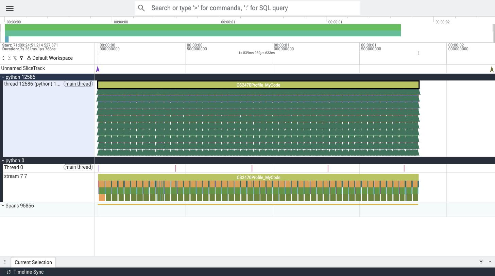
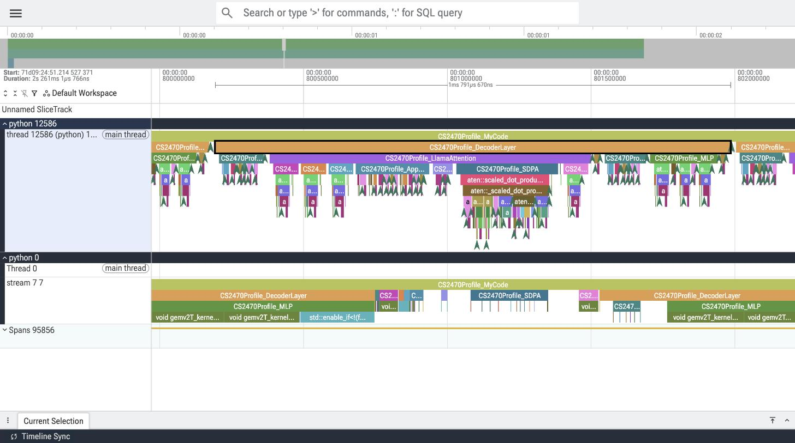
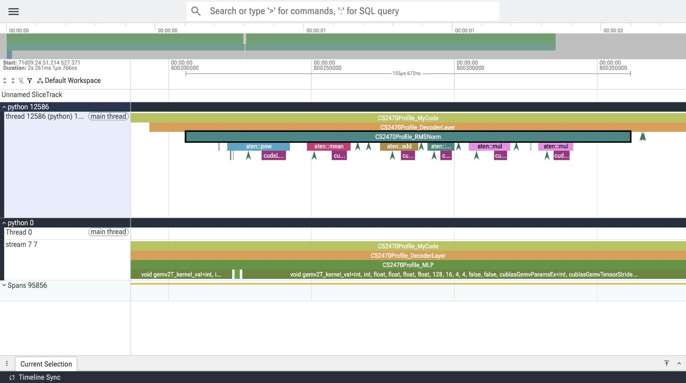
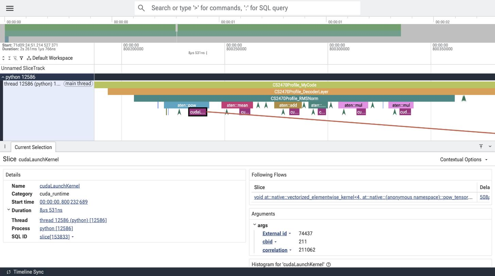
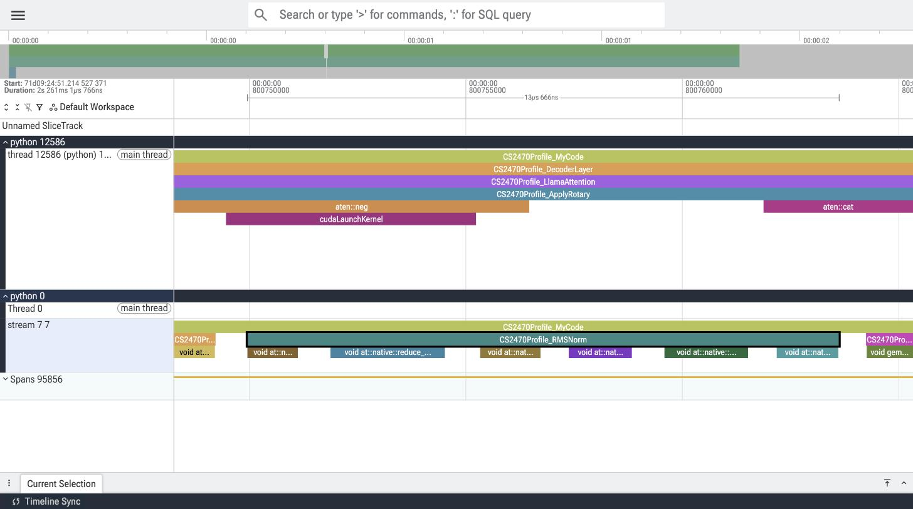
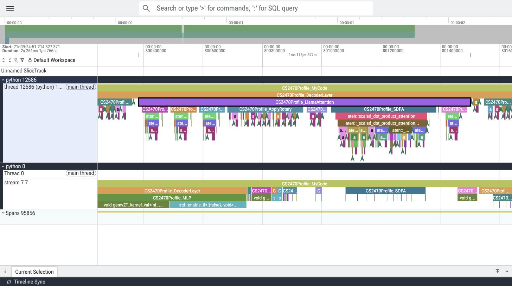
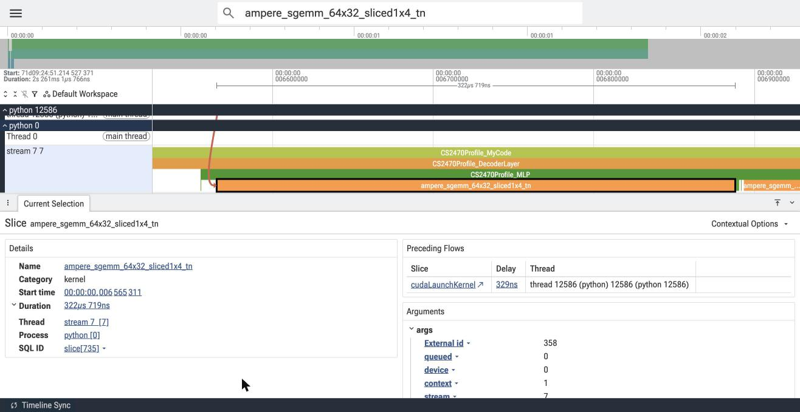

# Lab 1: GPU Profiling Part I (PyTorch Profiler)

CS2470 Advanced Computer Architecture, Fall 2026

## Setup

- **Workload:** `meta-llama/Llama-3.2-1B` in fp32, batch size 1, prompt `"Hello, how are you?"`, `max_new_tokens=50` (1 prefill pass + 49 decode passes)
- **Hardware:** NVIDIA A10G (Ampere) on the HUIT academic cluster
- **Software:** PyTorch 2.8.0+cu128, transformers 4.57.6
- **Annotations:** `model.generate()` is wrapped in `CS2470Profile_MyCode` (Part III-A). Inside `modeling_llama.py` (Part III-B), `record_function` blocks mark `DecoderLayer`, `RMSNorm`, `LlamaAttention`, `MLP`, `RotaryEmbedding`, `Embedding`, and `LMHead`, plus `QProj`, `KProj`, `VProj`, `ApplyRotary`, `KVCacheUpdate`, `SDPA`, and `OProj` inside attention.


*The full profiled `generate()` call (about 1.84 s). `CS2470Profile_MyCode` spans the run on both the CPU thread (top) and GPU stream 7 (bottom), and each repeated block on the GPU is one forward pass.*


*One `CS2470Profile_DecoderLayer` (about 1.8 ms) with `RMSNorm`, `LlamaAttention` (and its `QProj`, `KProj`, `VProj`, `ApplyRotary`, `KVCacheUpdate`, `SDPA`, and `OProj` children), and `MLP` nested beneath it. PyTorch mirrors the annotations onto the GPU stream, where they trail the CPU because kernels execute after they are launched.*

## Exercise I: Understanding Profiled Output

### Q1. How many GPU kernels are executed during one RMSNorm execution?

**6 kernels.** All 1,650 RMSNorm calls in the trace (50 forward passes × 33 norms per pass) launch the same 6:

| # | Code in `LlamaRMSNorm.forward` | aten op | GPU kernel |
|---|---|---|---|
| 1 | `hidden_states.pow(2)` | `aten::pow` | `vectorized_elementwise_kernel<4, pow_tensor_scalar_kernel_impl<float, float>>` |
| 2 | `.mean(-1, keepdim=True)` | `aten::mean` | `reduce_kernel<512, 1, ReduceOp<float, MeanOps<...>>>` |
| 3 | `variance + self.variance_epsilon` | `aten::add` | `vectorized_elementwise_kernel<4, CUDAFunctorOnSelf_add<float>>` |
| 4 | `torch.rsqrt(...)` | `aten::rsqrt` | `vectorized_elementwise_kernel<4, rsqrt_kernel_cuda(...)>` |
| 5 | `hidden_states * torch.rsqrt(...)` | `aten::mul` | `elementwise_kernel<128, 2, BinaryFunctor<float, float, float, MulFunctor<float>>>` |
| 6 | `self.weight * hidden_states` | `aten::mul` | `vectorized_elementwise_kernel<4, BinaryFunctor<float, float, float, MulFunctor<float>>>` |

The two `.to(dtype)` calls in RMSNorm launch nothing because the model already runs in fp32, so casting to the same dtype is a no-op (in bf16 these would add 2 cast kernels). The two multiplies use different kernel templates because #5 broadcasts one scalar per token across the 2048-wide hidden vector, which rules out PyTorch's vectorized path.


*CPU side: one `CS2470Profile_RMSNorm` contains 6 aten ops (`pow`, `mean`, `add`, `rsqrt`, `mul`, `mul`), each ending in one `cudaLaunchKernel`.*


*Selecting the `pow` launch shows the flow arrow to the kernel it started. The kernel begins about 0.5 ms after the launch because the GPU is still finishing the previous layer's MLP.*


*GPU side: the same RMSNorm on stream 7 runs as 6 back-to-back kernels totaling about 13.7 µs.*

*Method:* zoomed into a `CS2470Profile_RMSNorm` slice in Perfetto (6 aten ops, each with one `cudaLaunchKernel` linked to a GPU kernel), then confirmed across all instances by matching launch correlation IDs to kernels in `profile.json`.

### Q2

Left blank in the handout (numbering goes from Q1 to Q3).

### Q3. List the aten functions that occur during the Attention operation.

`LlamaAttention.forward` directly calls 11 aten functions: `aten::linear`, `aten::view`, `aten::transpose`, `aten::unsqueeze`, `aten::mul`, `aten::slice`, `aten::neg`, `aten::cat`, `aten::add`, `aten::scaled_dot_product_attention`, and `aten::reshape`. Including the ops those dispatch to internally, 35 distinct aten functions run in every decode-step attention call. By annotation:

| Step | Called directly | Also runs internally |
|---|---|---|
| `QProj` / `KProj` / `VProj` | `linear`, `view`, `transpose` | `t`, `matmul`, `mm`, `reshape`, `_unsafe_view`, `as_strided` |
| `ApplyRotary` | `unsqueeze`, `mul`, `slice`, `neg`, `cat`, `add` | `as_strided` |
| `KVCacheUpdate` | `cat` | none |
| `SDPA` | `scaled_dot_product_attention`, `transpose` | `_scaled_dot_product_attention_math`, `mul`, `repeat_interleave`, `unsqueeze`, `expand`, `clone`, `empty_like`, `empty`, `copy_`, `flatten`, `view`, `matmul`, `bmm`, `reshape`, `_reshape_alias`, `_unsafe_view`, `_safe_softmax`, `softmax`, `_softmax`, `isneginf`, `all`, `scalar_tensor`, `fill_`, `where`, `to`, `as_strided` |
| (before `OProj`) | `reshape` | `view` |
| `OProj` | `linear` | `t`, `transpose`, `matmul`, `mm`, `reshape`, `view`, `_unsafe_view`, `as_strided` |

The 16 prefill attention calls run 9 additional ops (44 total): `ones`, `tril`, `resize_`, `add_`, and `contiguous` build the causal mask across the prompt tokens, and `_to_copy`, `empty_strided`, `lift_fresh`, and `detach_` create the KV cache on first use. Decode needs neither because it has a single query and an existing cache.

SDPA dispatches to PyTorch's unfused math fallback (`_scaled_dot_product_attention_math`), which is why attention expands into roughly 25 ops. I believe this is because fp32 inputs rule out FlashAttention and grouped-query attention rules out the memory-efficient kernel. `repeat_interleave` is the GQA expansion from 8 KV heads to 32 query heads done by hand.


*One `CS2470Profile_LlamaAttention` (about 1.1 ms of CPU time). `SDPA` holds the deepest stack of aten ops.*

*Method:* I read the ops under each sub-annotation by zooming into one `CS2470Profile_LlamaAttention` slice in Perfetto (screenshot above). Many ops are too thin to read at that zoom, so I confirmed the list with Perfetto's SQL mode (prefix the search bar with `:`). This query takes one decode-step attention slice on the CPU thread and lists every `aten::` op nested beneath it:

```sql
SELECT name, COUNT(*) AS times
FROM descendant_slice((
  SELECT id FROM slice
  WHERE name = 'CS2470Profile_LlamaAttention' AND category = 'user_annotation'
  ORDER BY ts LIMIT 1 OFFSET 20))
WHERE name LIKE 'aten::%'
GROUP BY name ORDER BY MIN(ts)
```

It returns 35 rows, matching the table above. The counts also line up with the code: `aten::linear` runs 4 times (the Q, K, V, and O projections), `aten::scaled_dot_product_attention` once, and `aten::neg` twice (rotary embedding rotates both Q and K). `category = 'user_annotation'` selects the CPU copy of the annotation rather than its GPU-side mirror, and `OFFSET 20` skips the 16 prefill calls (`OFFSET 0` returns the prefill set of 44). Lastly, a script over `profile.json` checked all 800 attention slices: all 784 decode calls produce the identical set of 35, and all 16 prefill calls produce the same 44.

### Q4. What is the start time of the first `ampere_sgemm_64x32_sliced1x4_tn` kernel of the workload's execution?

**00:00:00.006 565 311 in Perfetto, i.e. 6.565 ms after the trace starts** (raw `ts` in `profile.json`: 6168291221092.682 µs). The kernel runs for 322.7 µs inside the first decoder layer's `CS2470Profile_MLP` during prefill. Perfetto reports times relative to the start of the trace (when the profiler began recording), not the start of `CS2470Profile_MyCode`.

This kernel appears 48 times, all during the prefill pass and all inside `CS2470Profile_MLP`: 16 layers × 3 MLP projections (`gate_proj`, `up_proj`, `down_proj`), each taking 297 to 323 µs. It never appears during decode. Prefill pushes every prompt token through the MLP at once, so each projection is a matrix-matrix multiply that cuBLAS maps to this SGEMM kernel. Decode processes one token per step, which turns the same projections into matrix-vector products that run on `gemv` kernels instead.


*The first `ampere_sgemm_64x32_sliced1x4_tn` selected on GPU stream 7, nested under `CS2470Profile_MLP` in the first decoder layer. The details panel shows its start time and duration.*

*Method:* searched the kernel name in Perfetto and stepped to the first of its 48 matches (search results are ordered by time). Confirmed with Perfetto's SQL mode:

```sql
SELECT s.ts - (SELECT start_ts FROM trace_bounds) AS start_ns, s.dur AS dur_ns,
  (SELECT GROUP_CONCAT(a.name, ' > ') FROM ancestor_slice(s.id) a) AS inside
FROM slice s
WHERE s.name = 'ampere_sgemm_64x32_sliced1x4_tn'
ORDER BY s.ts LIMIT 3
```

The first row returns `start_ns = 6565311`, nested under `CS2470Profile_MyCode > CS2470Profile_DecoderLayer > CS2470Profile_MLP`. A second query confirmed that all 48 instances fall before the second forward pass begins on the GPU and all 48 sit inside `CS2470Profile_MLP`.
