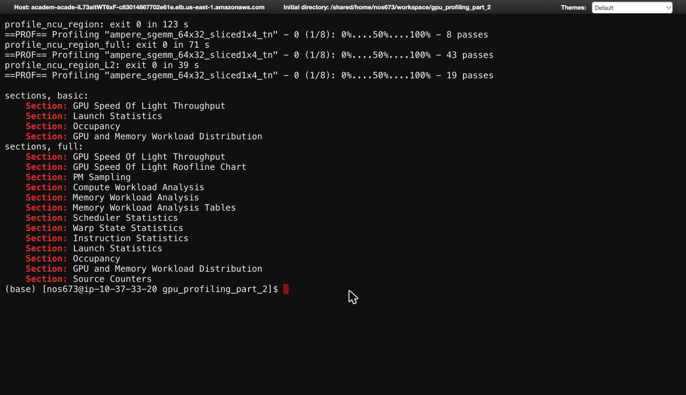
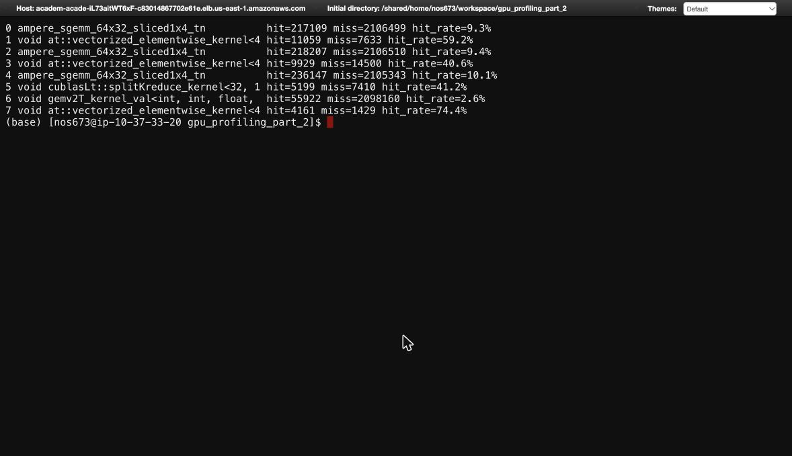

# Lab 2: GPU Profiling Part II (Nsight Compute)

CS2470 Advanced Computer Architecture, Fall 2026

## Setup

- **Workload:** `meta-llama/Llama-3.2-1B` in fp32, batch size 1, prompt `"Hello, how are you?"`, `max_new_tokens=50`
- **Script:** `code/profile_ncu_workload.py` runs 1 warmup `generate()` and then 1 measured `generate()`
- **Hardware:** NVIDIA L4 (Ada, compute capability 8.9, 58 SMs) on node `gpu-dy-gpu-cr-1` of the HUIT academic cluster
- **Software:** Nsight Compute 2025.3.1 (CUDA 13.0)
- **Annotations:** I removed the Lab 1 annotations first (`annotate_llama.py --restore`), so the model source is stock
- **Profiling run:** `code/run_ncu_part1.sbatch` calls `ncu -o profile_ncu_basic_300 -f -c 300 python profile_ncu_workload.py`. `-c 300` stops capturing after the first 300 kernel launches (instead of stopping the run with Ctrl+C). ncu collects its default (basic) section set, which takes 8 passes per kernel.
- **What got captured:** all 300 kernels come from the warmup `generate()`, which covers setup, the embedding lookup, and layers 0 to ~4 of prefill
- **Text dumps:** `code/extract.sh` turns the report into text files: `out/session.txt` (session page), `out/list.csv` (one row per kernel with its ID, name, and duration), `out/k{30,75,77}.txt` (the details page for each kernel the lab asks about), and `out/k{30,75,77}_raw.txt` (every raw metric for those kernels)
- **Kernel IDs:** these are ncu's 0-based IDs. `extract.sh` selects kernel N with `--launch-skip N --launch-count 1`, and I checked each dump against row N of `list.csv`.

## Exercise I: GPU Architecture

All 8 answers come from the `device__attribute_*` metrics on ncu's raw page (I used kernel 30, but every kernel shows the same values).

| # | Question | Answer |
|---|---|---|
| 1 | What is the clock rate of the GPU? | **2.04 GHz** |
| 2 | What is the memory clock rate? | **6.251 GHz** |
| 3 | What is the L2 cache size? | **48 MiB** |
| 4 | What is the maximum number of registers per block? | **65,536** |
| 5 | How many warps per scheduler can there be (at maximum)? | **12** |
| 6 | How many memory pools are supported? | **1** |
| 7 | What is the warp size? | **32** |
| 8 | What is the total memory size? | **22.03 GiB** (23,659,151,360 bytes) |

A few notes:

- **Clock:** 2.04 GHz is the max clock. During profiling the GPU actually ran at ~800 MHz, because ncu locks it to its base clock so results are repeatable. That means the kernel times below are slower than a normal run.
- **Warps:** each SM has 4 schedulers × 12 warps = 48 warps max. That 48 is the ceiling for occupancy in Q5.
- **L2:** 48 MiB is big, but the model's weights are ~4.9 GB, so the weights can't stay in cache and have to come from main memory (DRAM).

## Exercise II: Kernel Analysis

To make sense of kernel numbers, I first matched the kernels to the parts of the model that launched them:

| IDs | What runs | Part of the model |
|---|---|---|
| 0 to 13 | small setup kernels | `generate()` setup |
| 14 | `indexSelectSmallIndex` | embedding lookup |
| 24 to 29 | small math kernels | RMSNorm |
| **30** | `gemmSN_TN_kernel` | `q_proj` (attention) |
| 31 to 72 | various | rest of attention + RMSNorm |
| 73 | `ampere_sgemm_64x32_sliced1x4_tn` | `gate_proj` (MLP) |
| **75** | `ampere_sgemm_64x32_sliced1x4_tn` | `up_proj` (MLP) |
| **77** | `ampere_sgemm_64x32_sliced1x4_tn` | `down_proj` (MLP) |

### Q1. What is the name and duration of kernel 77?

**`ampere_sgemm_64x32_sliced1x4_tn`, 327.39 µs.** It's a matrix multiply for the MLP's `down_proj`. It splits the work into 7 pieces, and kernel 78 adds those pieces together.

### Q2

Left blank in the handout.

### Q3. How many kernels come before the first indexSelect kernel?

**14 kernels** (IDs 0 to 13). The first `indexSelect` is kernel 14, which is the embedding lookup (turning token IDs into vectors). The 14 kernels before it are setup work inside `generate()`, like building the attention mask and position IDs.

### Q4. What is the compute throughput of kernel 75? What is the memory throughput?

**Compute: 38.77%. Memory: 83.50%.**

These show how busy each side of the GPU was compared to its max. Memory is much busier than compute, so this kernel is **memory-bound**: it spends most of its time waiting on data, not doing math. That makes sense because it reads 64 MiB of weights but only multiplies them against 7 tokens, so there's very little math per byte loaded.

### Q5. Kernel 30

Kernel 30 is `gemmSN_TN_kernel`, the matrix multiply for `q_proj` in attention. It runs for 92.19 µs with 256 blocks of 128 threads.

| | Question | Answer |
|---|---|---|
| a | What is the L1/TEX cache throughput? | **86.52%** |
| b | What is the L2 cache throughput? | **28.68%** |
| c | How many active warps per SM are achieved? | **15.75** |
| d | How many registers per thread are used? | **72** |
| e | Average / min / max DRAM cycles active? | **426,930.67 / 424,944 / 428,912** |
| f | How does occupancy change with shared memory per block? | see below |

**a, b.** L1 is busy because the kernel keeps rereading small chunks of data it has loaded close by. L2 is less busy because each weight only passes through it once on its way from main memory.

**c.** 15.75 warps per SM out of a max of 48 (32.8%). The kernel could fit 24, but it only launches 256 blocks, which isn't enough work to fill all 58 SMs.

**d.** 72 registers per thread. This matters in (f), because registers limit how many blocks fit on an SM.

**e.** Main memory is split into 6 parts. Min and max are within 1% of each other, so the work was spread evenly across all 6.

#### f. Describe how percent occupancy changes over shared memory usage per block.

**Occupancy goes down in steps as each block uses more shared memory.**

Occupancy means how many warps are loaded on an SM compared to the max (48). More warps loaded means the GPU has more work to switch to while some warps wait on memory.

Each SM has a fixed 102.4 KB of shared memory. The more each block uses, the fewer blocks fit. Blocks are all or nothing, so occupancy drops in steps instead of smoothly:

| Shared memory per block | Blocks that fit | Occupancy |
|---|---|---|
| up to 14.6 KB | 7 | 58% (registers are the limit here) |
| 14.6 to 17.1 KB | 6 | 50% ← **kernel 30 (14.84 KB)** |
| 17.1 to 20.5 KB | 5 | 42% |
| 20.5 to 25.6 KB | 4 | 33% |
| 25.6 to 34.1 KB | 3 | 25% |
| 34.1 to 51.2 KB | 2 | 17% |
| 51.2 to ~99 KB | 1 | 8% |

Each step is just 102.4 KB divided by the number of blocks (102.4 / 7 = 14.6, 102.4 / 6 = 17.1, and so on).

Two takeaways:
- The top is 58%, not 100%, because registers (from d) cap the kernel at 7 blocks even with no shared memory.
- Kernel 30 is just past a step, so trimming ~0.2 KB would raise it to 58%. That probably wouldn't speed it up much though, since the real issue (from c) is that it doesn't launch enough blocks to fill the GPU.

## Parts III and IV: Narrowing and Customizing the Profile

These parts have no graded questions, but I ran them to see what each option does.

**Setup.** I wrapped layer 0's MLP in an NVTX range named `Annotation`. NVTX lets you tag a block of code, and `--nvtx --nvtx-include "Annotation/"` tells ncu to only profile kernels inside that tag. I ran it three ways: default metrics, `--set full`, and just the L2 metric group.

Note: this job ran on an **A10G**, not the L4 from Parts I and II. The cluster's GPU label doesn't guarantee which GPU you get.

### Part III: NVTX range

ncu only profiled the MLP, as expected. It captured the prefill MLP (3 matrix multiplies plus small elementwise kernels) and then the start of the first decode step.

| ID | Kernel | Duration (µs) | What it is |
|---|---|---|---|
| 0 | `ampere_sgemm_64x32_sliced1x4_tn` | 171.55 | `gate_proj` |
| 1 | `vectorized_elementwise_kernel` | 3.94 | SiLU |
| 2 | `ampere_sgemm_64x32_sliced1x4_tn` | 170.69 | `up_proj` |
| 3 | `vectorized_elementwise_kernel` | 3.78 | multiply |
| 4 | `ampere_sgemm_64x32_sliced1x4_tn` | 163.62 | `down_proj` |
| 5 | `splitKreduce_kernel` | 3.65 | finishes `down_proj` |
| 6 | `gemv2T_kernel_val` | 140.70 | `gate_proj` (decode) |
| 7 | `vectorized_elementwise_kernel` | 3.46 | SiLU (decode) |

The main takeaway: in decode the MLP handles 1 token instead of 7, but the kernel only gets ~18% faster (171 to 141 µs). That's because both kernels still have to read the same 64 MiB of weights from memory, and that's what takes the time. The MLP is memory-bound.

### Part IV: `--set full`

`--set full` ran each kernel **43 times** instead of **8**, and collected **13 sections instead of 4** (adding things like a roofline chart and warp stall reasons). ncu has to rerun the kernel because the GPU can only count a few things at once. So more metrics means a much slower profile, roughly 5x here.

### Part IV: L2 metric group

Asking for only the L2 metrics took **19 runs per kernel**, in between the other two.

The matrix multiply kernels found their data in L2 only 2 to 10% of the time. Their misses add up to 64.3 MiB, which is exactly the size of the weight matrix. So basically every weight is read from main memory once and never reused, which backs up my Q4 and Q5 answers. The small elementwise kernels hit L2 40 to 74% of the time, because they read data the previous kernel just wrote.

**In short:** NVTX picks *which* kernels you profile, and the metric set picks *how much* data you collect on each one, at the cost of more reruns.
