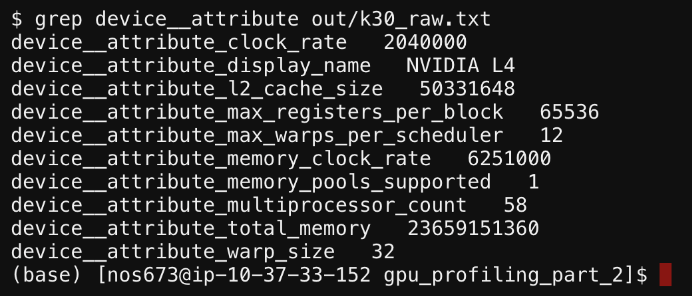
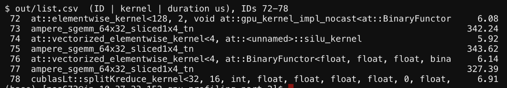
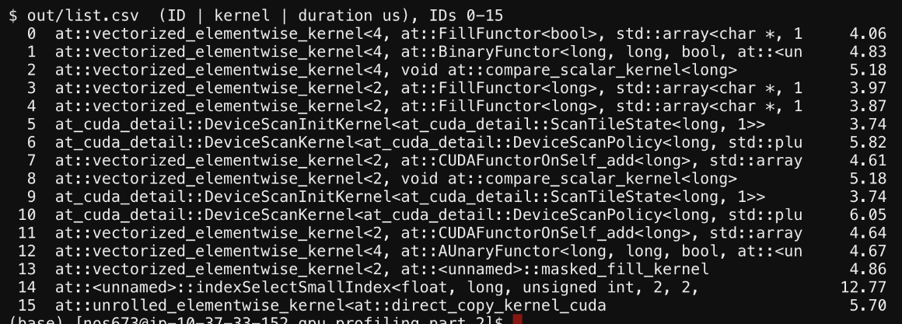
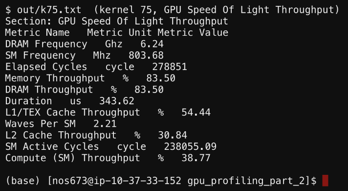
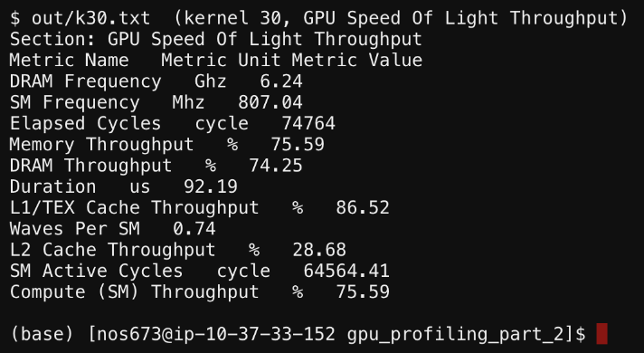
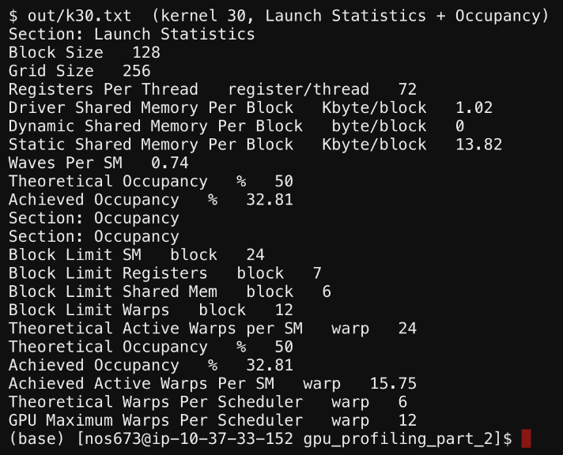
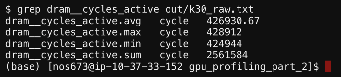
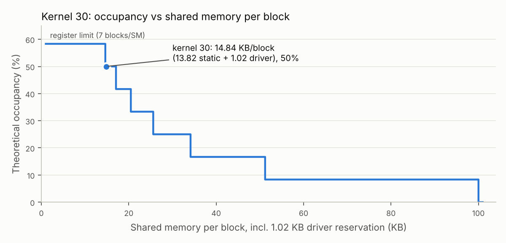

# Lab 2: GPU Profiling Part II (Nsight Compute)

CS2470 Advanced Computer Architecture, Fall 2026

## Setup

- **Workload:** `meta-llama/Llama-3.2-1B` in fp32, batch size 1, prompt `"Hello, how are you?"`, `max_new_tokens=50`
- **Script:** `code/profile_ncu_workload.py` runs 1 warmup `generate()` and then 1 measured `generate()`
- **Hardware:** NVIDIA L4 (Ada, compute capability 8.9, 58 SMs) on node `gpu-dy-gpu-cr-1` of the HUIT academic cluster
- **Software:** Nsight Compute 2025.3.1 (CUDA 13.0)
- **Annotations:** I removed the Lab 1 annotations first (`annotate_llama.py --restore`), so the model source is stock
- **Profiling run:** `code/run_ncu_part1.sbatch` calls `ncu -o profile_ncu_basic_300 -f -c 300 python profile_ncu_workload.py`. `-c 300` stops capturing after the first 300 kernel launches (instead of stopping the run with Ctrl+C). ncu collects its default (basic) section set, which takes 8 passes per kernel.
- **What got captured:** all 300 kernels come from the warmup `generate()`, which covers setup, the embedding lookup, and layers 0 to ~4 of prefill
- **Text dumps:** `code/extract.sh` turns the report into text files: `out/session.txt` (session page), `out/list.csv` (one row per kernel with its ID, name, and duration), `out/k{30,75,77}.txt` (the details page for each kernel the lab asks about), and `out/k{30,75,77}_raw.txt` (every raw metric for those kernels)
- **Kernel IDs:** these are ncu's 0-based IDs. `extract.sh` selects kernel N with `--launch-skip N --launch-count 1`, and I checked each dump against row N of `list.csv`.

## Exercise I: GPU Architecture

All 8 answers come from one place: the `device__attribute_*` metrics on the raw page of any profiled kernel. I used `out/k30_raw.txt`, but the values are the same on every kernel. The session page only lists the SM count, device name, compute capability, and total memory, so the raw page is the one to use.

1. What is the clock rate of the GPU?
2. What is the memory clock rate?
3. What is the L2 cache size?
4. What is the maximum number of registers per block?
5. How many warps per scheduler can there be (at maximum)?
6. How many memory pools are supported?
7. What is the warp size?
8. What is the total memory size?

| # | Question | Answer | Raw metric (`device__attribute_` prefix) |
|---|---|---|---|
| 1 | GPU clock rate | **2.04 GHz** | `clock_rate` = 2,040,000 kHz |
| 2 | Memory clock rate | **6.251 GHz** | `memory_clock_rate` = 6,251,000 kHz |
| 3 | L2 cache size | **48 MiB** | `l2_cache_size` = 50,331,648 B |
| 4 | Max registers per block | **65,536** | `max_registers_per_block` |
| 5 | Max warps per scheduler | **12** | `max_warps_per_scheduler` (also "GPU Maximum Warps Per Scheduler" in the Occupancy section) |
| 6 | Memory pools supported | **1 (supported)** | `memory_pools_supported` |
| 7 | Warp size | **32** | `warp_size` |
| 8 | Total memory | **22.03 GiB (23.66 GB)** | `total_memory` = 23,659,151,360 B |

A few of these need context before they get used later. 2.04 GHz is the max boost clock, though the SM clock measured during profiling is only ~800 MHz (the "SM Frequency" row in the GPU Speed Of Light section). This is because ncu locks clocks to base by default (`--clock-control base`), so the durations in Exercise II are slower than they would be in a normal run. The 12 warps per scheduler multiply out to 48 warps per SM (12 × 4 schedulers, which matches `max_warps_per_multiprocessor` = 48), and 48 is the ceiling for the occupancy numbers in Q5. The memory bus is 192 bits wide (`global_memory_bus_width`), i.e. 6 × 32-bit channels, and that 6 shows up again in Q5e. Lastly, the 48 MiB L2 is big but still ~100x smaller than the fp32 weights (~4.9 GB), so weight reads stream from DRAM.

*Every `device__attribute_*` metric in kernel 30's raw metric dump, which covers all 8 questions.*

*Method:* `code/extract.sh` exports the raw page for kernel 30 to `out/k30_raw.txt`, and `grep device__attribute out/k30_raw.txt` pulls out the device attributes (screenshot above). From there it is unit conversion: kHz to GHz for the two clocks, and bytes to MiB/GiB for the L2 and total memory.

## Exercise II: Kernel Analysis

Kernel IDs only mean something once you know which part of the model launched them, so before answering I mapped layer 0 of prefill in `list.csv` back to the model ops. Kernels 30, 75, and 77 (bold) are the ones the questions ask about.

| IDs | Kernels | Model op |
|---|---|---|
| 0 to 13 | fill, scan, elementwise | `generate()` setup: attention mask, position ids, cache position |
| 14 | `indexSelectSmallIndex` | token embedding lookup |
| 20 to 22 | `cos`, `sin`, scale | rotary embedding |
| 24 to 29 | `pow`, `reduce`, `add`, `rsqrt`, `mul`, `mul` | input RMSNorm |
| **30** | `gemmSN_TN_kernel` | `q_proj` |
| 31 to 34 | `ampere_sgemm_32x32` + `splitKreduce` × 2 | `k_proj`, `v_proj` |
| 35 to 64 | elementwise, cat, softmax, small GEMMs | rotary apply, KV cache, SDPA math path |
| 65 | `gemmSN_TN_kernel` | `o_proj` |
| 67 to 72 | RMSNorm kernels | post-attention RMSNorm |
| 73 | `ampere_sgemm_64x32_sliced1x4_tn` | `gate_proj` |
| **75** | `ampere_sgemm_64x32_sliced1x4_tn` | `up_proj` |
| **77** | `ampere_sgemm_64x32_sliced1x4_tn` + 78 `splitKreduce` | `down_proj` |

### Q1. What is the name and duration of kernel 77?

**`ampere_sgemm_64x32_sliced1x4_tn`, 327.39 µs.** This is the layer 0 MLP `down_proj` in prefill (8192 to 2048), and it is the same prefill MLP SGEMM kernel from Lab 1 Q4. It launches with a grid of (32, 1, 7) and 256 threads per block. The z dimension of 7 is split-K, meaning the kernel produces 7 partial results, and kernel 78 (`splitKreduce_kernel`) then sums them into the final output.

*Rows 72 to 78 of `list.csv`, with kernel 77 at 327.39 µs followed by the `splitKreduce_kernel` that finishes it.*

*Method:* read the Duration row of the GPU Speed Of Light section in `out/k77.txt` (the details page for kernel 77), then cross-checked it against row 77 of `out/list.csv` (screenshot above). The grid and block size come from the Launch Statistics section of the same details page.

### Q2

Left blank in the handout (numbering goes from Q1 to Q3).

### Q3. How many kernels come before the first indexSelect kernel?

**14 kernels** (IDs 0 to 13). The first `indexSelectSmallIndex` is ID 14 (12.77 µs), and it is the only `indexSelect` in the 300 captured kernels: the embedding lookup for the prompt (`nn.Embedding` calls `aten::index_select`).

The 14 kernels before it belong to `generate()` setup rather than the model. The `FillFunctor` and other elementwise kernels build the attention mask, `unfinished_sequences`, and similar bookkeeping tensors, while the 2 pairs of `DeviceScanInitKernel` + `DeviceScanKernel` are `cumsum` calls for the position ids / cache position.

*Rows 0 to 15 of `list.csv`: 14 setup kernels, then `indexSelectSmallIndex` at ID 14.*

*Method:* searched `out/list.csv` for the first row whose kernel name contains `indexSelect`. Since ncu's IDs start at 0, that row's ID (14) is also the number of kernels before it. I then read the names in rows 0 to 13 (screenshot above) to tie each one to the setup step that launches it.

### Q4. What is the compute throughput of kernel 75? What is the memory throughput?

**Compute (SM) throughput is 38.77%, and memory throughput is 83.50%.** Kernel 75 is `ampere_sgemm_64x32_sliced1x4_tn` again, this time for layer 0 `up_proj` (2048 to 8192). It runs for 343.62 µs with a grid of (128, 1, 2) and 256 threads per block.

Both numbers come from ncu's GPU Speed Of Light section, which reports how busy the compute and memory sides of the GPU were as a percentage of their peak. With memory at 83.50% and compute at 38.77%, this kernel is memory-bound, and DRAM throughput is also 83.50%, so DRAM is the busiest memory unit and the bottleneck. The reason is the shape of the problem. Prefill has only 7 tokens (BOS + 6), so the GEMM is a thin 7 × 2048 by 2048 × 8192 multiply that reads 64 MiB of fp32 weights and does little math per byte. The cache numbers fit this picture (L1/TEX 54.44%, L2 30.84%), since the weights stream through once with low reuse.

*Kernel 75's GPU Speed Of Light Throughput section, with Compute (SM) Throughput at 38.77% and Memory Throughput at 83.50%.*

*Method:* read Compute (SM) Throughput and Memory Throughput from the GPU Speed Of Light Throughput section of `out/k75.txt` (screenshot above). The DRAM, L1/TEX, and L2 rows in the same section show where the memory traffic goes, and the grid size comes from Launch Statistics.

### Q5. Kernel 30

Kernel 30 is `gemmSN_TN_kernel<float, 128, 16, 2, 4, 8, 9, 0, ...>`, the layer 0 `q_proj` (2048 to 2048) in prefill. It runs for 92.19 µs with a grid of 256 blocks of 128 threads.

| Sub | Question | Answer | Where in ncu |
|---|---|---|---|
| a | What is the L1/TEX cache throughput? | **86.52%** | GPU Speed Of Light |
| b | What is the L2 cache throughput? | **28.68%** | GPU Speed Of Light |
| c | How many active warps per SM are achieved? | **15.75** (of 24 theoretical, 48 max) | Occupancy |
| d | How many registers per thread are used? | **72** | Launch Statistics |
| e | What is the average number of DRAM cycles active? What about the minimum? What is the maximum? | **426,930.67 avg / 424,944 min / 428,912 max** | raw `dram__cycles_active.{avg,min,max}` |
| f | Describe how percent occupancy changes over shared memory usage per block. | see f below | Occupancy chart data |

#### a, b. L1/TEX and L2 cache throughput

**L1/TEX is at 86.52% and L2 is at 28.68%.** L1 runs high while L2 runs low because this small-N GEMM kernel stages tiles in shared memory and re-reads them for each output column (the LSU pipe, at 75.6%, is the top compute unit), while each weight goes through L2 only once. DRAM throughput is 74.25%, so like kernel 75 in Q4 this kernel is also close to memory-bound.

*Kernel 30's GPU Speed Of Light Throughput section, with L1/TEX Cache Throughput at 86.52% and L2 Cache Throughput at 28.68%.*

*Method:* read L1/TEX Cache Throughput and L2 Cache Throughput from the GPU Speed Of Light Throughput section of `out/k30.txt` (screenshot above). DRAM Throughput is in the same section.

#### c. Achieved active warps per SM

**15.75 warps per SM (32.8% achieved occupancy).** The theoretical ceiling for this kernel is 24 warps (50%), out of the 48 the hardware allows. I would argue the gap between 24 and 15.75 is mostly the grid rather than anything inside the kernel: 256 blocks across 58 SMs × 6 blocks/SM = 348 slots is only 0.74 waves, so many SMs run under-filled.

#### d. Registers per thread

**72 registers per thread.** This number matters again in f, because 72 registers × 128 threads is what caps the kernel at 7 blocks per SM before shared memory comes into play.

*Kernel 30's Launch Statistics and Occupancy sections, showing 72 registers per thread, 1.02 KB of driver plus 13.82 KB of static shared memory per block, and 15.75 achieved active warps per SM.*

*Method (c and d):* read Achieved Active Warps Per SM and Theoretical Active Warps per SM from the Occupancy section of `out/k30.txt`, and Registers Per Thread from the Launch Statistics section (screenshot above). The 0.74 waves is Waves Per SM in Launch Statistics, and the 6 blocks/SM in the slot math is the Block Limit Shared Mem row in Occupancy.

#### e. DRAM cycles active

**Average 426,930.67, minimum 424,944, maximum 428,912.** The sum (2,561,584) is exactly 6 × the average, so these are averaged over 6 DRAM units, which lines up with the 6 × 32-bit channels of the 192-bit bus from Exercise I. The spread from min to max is under 1% (73.9% to 74.6% of peak), so the load is spread evenly across channels with no hot partition.

*The avg, max, min, and sum of `dram__cycles_active` from kernel 30's raw metrics.*

*Method:* these values are on the raw page rather than the details page, so I ran `grep dram__cycles_active out/k30_raw.txt` (screenshot above). The metric has `.avg`, `.min`, `.max`, and `.sum` variants, and dividing `.sum` by `.avg` gives the number of units it is measured across (6).

#### f. Describe how percent occupancy changes over shared memory usage per block.

**Theoretical occupancy is a step function that only drops as shared memory per block grows.** It stays flat at 58.3% (capped by registers) for small allocations, then steps down each time one fewer block fits in the SM's shared memory, until a block cannot launch at all. Kernel 30 uses 13.82 KB of static shared memory plus 1.02 KB reserved by the driver (14.84 KB per block in total), which fits 6 blocks/SM, i.e. 24 warps and **50% theoretical occupancy**. Shared memory is the binding limit for this kernel (ncu's block limits: shared memory 6, registers 7, warps 12, SM 24).

| Shared mem per block (incl. driver) | Blocks/SM | Theoretical occupancy | Limiter |
|---|---|---|---|
| 0 to 14.6 KB | 7 | 58.3% | registers (72 regs × 128 threads) |
| 14.6 to 17.1 KB | 6 | 50% | smem (kernel sits here) |
| 17.1 to 20.5 KB | 5 | 41.7% | smem |
| 20.5 to 25.6 KB | 4 | 33.3% | smem |
| 25.6 to 34.1 KB | 3 | 25% | smem |
| 34.1 to 51.2 KB | 2 | 16.7% | smem |
| 51.2 to ~99 KB | 1 | 8.3% | smem |
| > ~99 KB | 0 | 0% | can't launch (99 KB opt-in max per block) |

The shape is flat on the left, where registers cap it at 58%, and then a staircase down as fewer blocks fit in the SM's 102.4 KB of shared memory (100 KiB), with each block also carrying the 1.02 KB driver reservation. The point here is that shared memory tuning would not buy much for this kernel. Cutting its shared memory by ~1 KB would only move theoretical occupancy from 50% to 58%, since registers become the cap at that point, and achieved occupancy (32.8%) is held down by the 0.74-wave grid anyway.

*Theoretical occupancy vs shared memory per block for kernel 30, computed from ncu's block limits (not a GUI screenshot). The x axis is the total per block, including the 1.02 KB driver reservation, and the kernel sits at 14.84 KB and 50%.*

*Method:* the Occupancy section includes a chart called "Impact of Varying Shared Memory Usage Per Block". On the command line, `ncu -i ... --page details --print-details all` prints that chart's data as text, and `out/k30.txt` has its 200 points in 0.5 KB steps. The static (13.82 KB) and driver (1.02 KB) shared memory per block come from Launch Statistics. I computed the curve as blocks/SM = ⌊102.4 KB / (smem + 1.02 KB)⌋, capped at 7 by registers, where smem is the kernel's own allocation, so the x axis value is smem + 1.02 KB. Each table boundary is 102.4 KB divided by a whole number of blocks (102.4 / 7 = 14.6, 102.4 / 6 = 17.1, and so on). ncu's own chart data is sampled in 0.5 KB steps, so its breakpoints land within ~0.5 KB of these.
