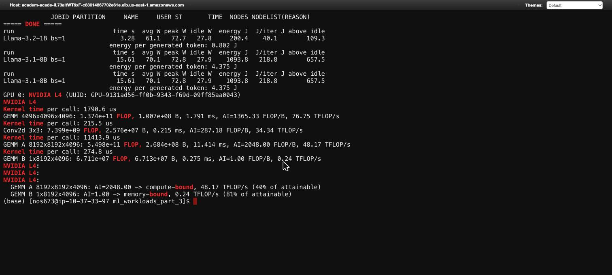
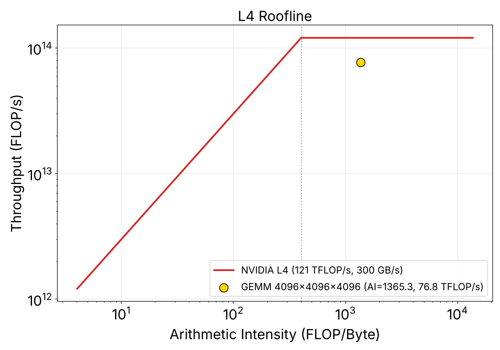
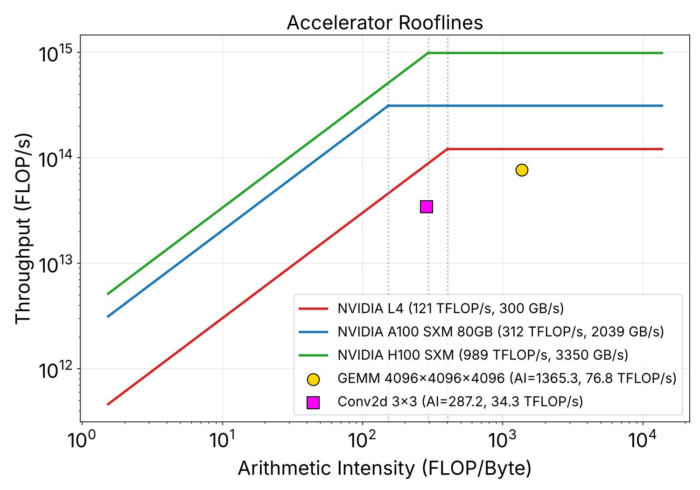
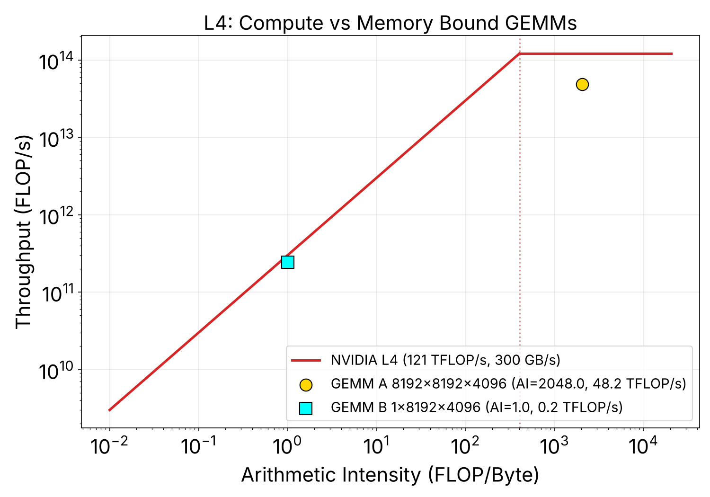
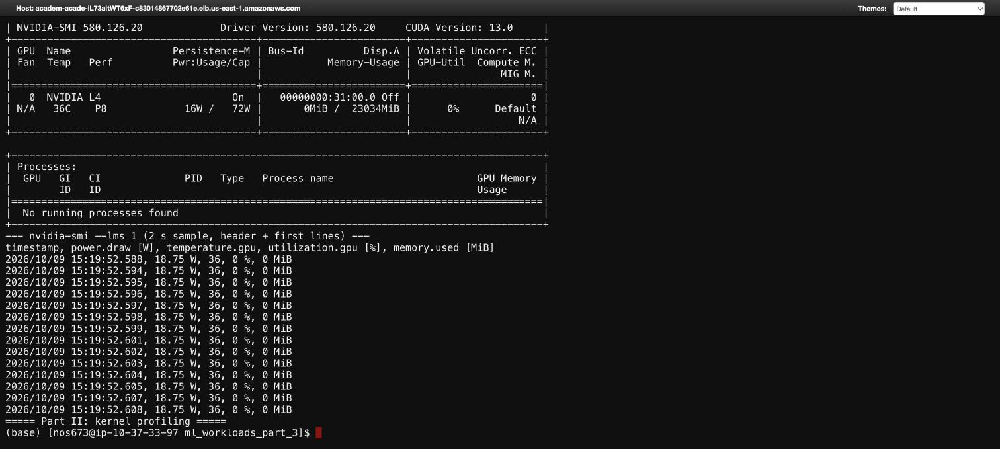
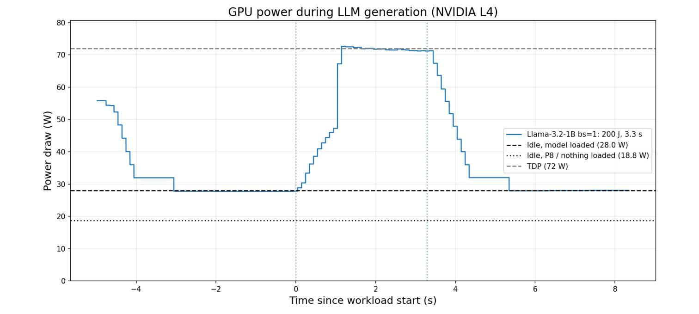
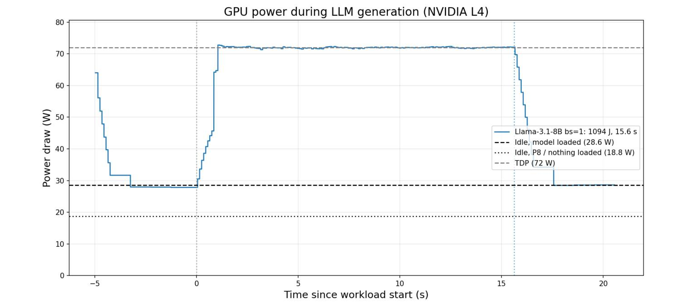
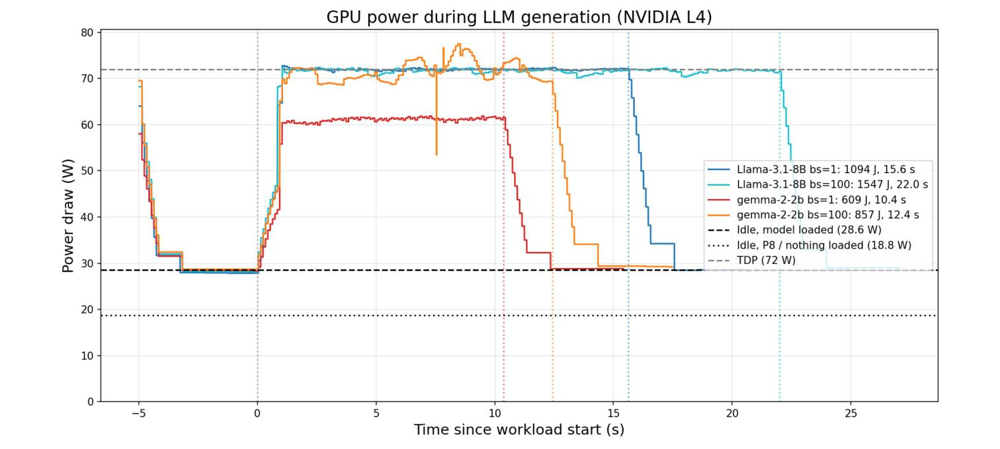
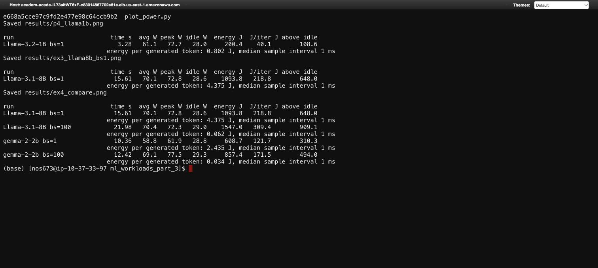

# Lab 3: ML Workloads Part III (Rooflines + NVIDIA-SMI)

CS2470 Advanced Computer Architecture, Fall 2026

## Setup

- **Hardware:** NVIDIA L4 (Ada, 23,034 MiB, 72 W power limit) on nodes `gpu-dy-gpu-cr-1` and `gpu-dy-gpu-cr-7` of the HUIT academic cluster
- **Software:** driver 580.126.20, CUDA 13.0, the `cs2470_env` conda env from Lab 0
- **Workspace:** `~/workspace/ml_workloads_part_3`
- **How I ran it:** batch jobs instead of an interactive `srun`, because the OOD web shell dropped my interactive session mid-run. `code/run_lab3.sbatch` runs every part in order (job 1700). `code/run_kernels.sbatch` reruns only Part II and the roofline plots (job 1701, see the note in Part II).
- **Precision:** everything is fp16. FLOP counts and byte counts below assume 2 bytes per element.

| File | What it does |
|---|---|
| `code/plot_roofline.py` | Part I template with the TODOs filled in, plus Exercise I and II plots |
| `code/profile_kernel.py` | Part II: times the GEMM and conv kernels with PyTorch Profiler, writes `kernels.json` |
| `code/profile_power_workload.py` | Part IV: logs `nvidia-smi` in a subprocess while an LLM runs `generate()` |
| `code/plot_power.py` | Exercises III and IV: power over time, idle and TDP lines, energy table |
| `code/run_lab3.sbatch` | Runs the whole lab end to end |
| `kernels.json` | Measured kernel data used for the roofline plots |

To reproduce:

```sh
cd ~/workspace/ml_workloads_part_3
sbatch run_lab3.sbatch          # ~10 min on an L4, writes lab3_<jobid>.log and results/
```

## Part I: Constructing a Roofline

A roofline has two pieces. On the left, performance is capped by memory bandwidth, so attainable FLOP/s = bandwidth × arithmetic intensity (AI). On the right, it is capped by peak compute. The two meet at the ridge point:

```
ridge AI = peak FLOP/s / peak bandwidth  (FLOP/Byte)
```

**Step 1, hardware data.** I used the dense FP16 Tensor Core numbers from NVIDIA's datasheets (without the 2:4 sparsity speedup, since our kernels are dense):

| GPU | Peak FP16 (dense) | Memory BW | Ridge point |
|---|---|---|---|
| L4 | 121 TFLOP/s | 300 GB/s | **403.3 FLOP/B** |
| A100 SXM 80GB | 312 TFLOP/s | 2,039 GB/s | **153.0 FLOP/B** |
| H100 SXM | 989 TFLOP/s | 3,350 GB/s | **295.2 FLOP/B** |

**Step 2, intersection point.** The template's TODO line becomes:

```py
x_intersection = peak_flops / peak_memory_bw
intersections.append({'name': name, 'x_intersection': x_intersection, ...})
```

**Step 3, plot the curves.** A sloped line from `min_x` to the ridge, then a flat line from the ridge to `max_x`:

```py
x_mem = np.geomspace(min_x, x_intersection, 200)
ax.plot(x_mem, peak_memory_bw * x_mem, color=color, label=name)            # memory roof
ax.plot([x_intersection, max_x], [peak_flops, peak_flops], color=color)     # compute roof
```

The L4's ridge is high (403 FLOP/B) because it has very little bandwidth for its compute. A kernel needs a lot of reuse per byte before the L4 stops being memory-bound.

## Part II: Adding Kernels to the Roofline

Each kernel needs two numbers. AI = FLOPs / bytes, and throughput = FLOPs / time. FLOPs and bytes are analytic. Time is measured.

For a GEMM `(M×K) @ (K×N)`:

```
FLOPs = 2·M·N·K                       (one multiply + one add per MAC)
Bytes = 2·(M·K + K·N + M·N)           (read A, read B, write C, once each, fp16)
```

For the 4096³ GEMM: 1.374e11 FLOPs, 1.007e8 bytes, so **AI = 1,365 FLOP/B**.

**Profiling.** I wrapped the GEMM in PyTorch Profiler, ran 10 warmup iterations, then profiled 20 and divided the GPU kernel time by 20:

```py
with profile(activities=[ProfilerActivity.CPU, ProfilerActivity.CUDA]) as prof:
    for _ in range(20):
        A @ B
    torch.cuda.synchronize()
# sum only GPU kernel events
total_us = sum(e.self_device_time_total for e in prof.events() if e.device_type == DeviceType.CUDA)
```

**Result:** 1.791 ms per call, so **76.8 TFLOP/s**, which is 63% of the L4's 121 TFLOP/s peak. The kernel PyTorch picked is `ampere_fp16_s1688gemm_fp16_128x128_ldg8_f2f_stages_3...` (name truncated in the profiler table).

Note on the timing code: my first version summed `self_device_time_total` across every row of `key_averages()`. That double counts, because CPU ops like `aten::cudnn_convolution` also carry the device time of the kernels they launch. It reported every kernel as ~2x slower than it was. Summing only events whose `device_type` is CUDA matches the profiler's own "Self CUDA time total" line. Job 1701 is the corrected run, and all numbers here come from it.





## Exercise I: Plotting Rooflines

**1. A100 and H100 rooflines** are added as two more entries in `platforms` (specs in the Part I table).

**2. Convolution kernel.** I used a ResNet-50 `conv2_x` layer: batch 32, 64→64 channels, 56×56, 3×3, stride 1, padding 1.

```
FLOPs = 2·N·K·H_out·W_out·C·R·S = 7.399e9
Bytes = 2·(input + weights + output) = 2.576e7
AI    = 287 FLOP/B
```

**Result:** 0.215 ms, **34.3 TFLOP/s**.



What the plot shows:

- **GEMM (AI 1,365)** is right of every ridge, so it is compute-bound on all three GPUs. On the L4 it reaches 63% of the compute roof.
- **Conv (AI 287)** sits left of the L4 ridge (403) but right of the A100 (153) and H100 (295) ridges. The same kernel is memory-bound on the L4 and compute-bound on the A100 and H100. That's the clearest takeaway of the plot: whether a kernel is "memory-bound" depends on the hardware, not just the kernel.
- **Conv efficiency** is only 40% of its L4 roof (86 TFLOP/s attainable at AI 287). Part of that is layout conversion. The profiler shows the actual convolution kernel (`sm86_xmma_fprop_implicit_gemm_f16f16_f16f32_f32_nhwc...`) is only 52% of the GPU time. The rest is converting the input from PyTorch's default NCHW layout to the NHWC layout the kernel wants. Using `channels_last` tensors would remove that.

## Exercise II: Compute-Bound vs Memory-Bound Kernels

| Kernel | Shape (M, K, N) | AI (FLOP/B) | Time | Throughput | Bound | % of attainable |
|---|---|---|---|---|---|---|
| GEMM A | 8192, 8192, 4096 | 2,048 | 11.414 ms | 48.2 TFLOP/s | **compute** | 40% |
| GEMM B | 1, 8192, 4096 | 1.0 | 0.275 ms | 0.24 TFLOP/s | **memory** | 81% |



**GEMM A is compute-bound** (AI 2,048, about 5x past the ridge). Every weight byte gets reused across 8,192 rows.

**GEMM B is memory-bound** (AI 1.0, about 400x below the ridge). With M = 1, each weight is read once and used for exactly one multiply-add. Almost all the bytes are the 8192×4096 weight matrix (64 MiB). The kernel moves 67 MB in 0.275 ms, which is **244 GB/s, or 81% of the L4's 300 GB/s**. It's doing about as well as the hardware allows, and the only way to speed it up is to move fewer bytes (quantize the weights) or batch more rows.

**Mapping to LLM inference:**

- **GEMM A = prefill.** The whole prompt (here 8,192 tokens) is processed at once, so M = number of tokens and every weight is reused across all of them.
- **GEMM B = decode.** Each step generates one token, so M = 1 and the full weight matrix is streamed from DRAM for a single row of math. This is why decode is memory-bound and why batching (more rows per weight read) helps so much, which Exercise IV confirms.

One more observation: GEMM A only hits 40% of peak while the smaller 4096³ GEMM hits 63%. I believe this is the 72 W power limit. GEMM A runs 11 ms per call for 20 calls back to back, long enough for the L4 to drop its clocks to stay under the cap (Part IV shows the card pinned at 72 W under any sustained load). I didn't log clocks during this run, so treat this as the likely cause rather than a measured one.

## Part III: Basic Measurements with NVIDIA-SMI



Reading the output for the idle GPU:

| Field | Value | Meaning |
|---|---|---|
| Power usage | **16 W** | Current draw. Nothing is running |
| Power cap | **72 W** | The power limit (TDP for the L4) |
| Temperature | **36 C** | |
| Perf state | **P8** | Deepest idle state. Clocks are parked |
| Memory used | **0 MiB / 23,034 MiB** | |
| Processes | **none** | |

`nvidia-smi --lms 1` (and the `--query-gpu ... -lms 1` form used in Part IV) prints a row about every 1 ms. The power value only changes about every 50 ms though, so most rows repeat the previous reading. 1 ms logging doesn't give 1 ms power resolution. In the sample at the bottom of the screenshot, power reads 18.75 W on every row.

## Part IV: Capturing Power During Workload Execution

`code/profile_power_workload.py` follows the template: launch `nvidia-smi --query-gpu=timestamp,power.draw,... -lms 1 > log.csv` as a subprocess, sleep 5 s, run 5 × `generate(max_new_tokens=50)`, sleep 5 s, stop the subprocess. I made three changes:

1. One warmup `generate()` **before** logging starts, so CUDA init and kernel autotuning aren't in the measurement
2. Wall-clock start and end timestamps of the workload are saved to a JSON next to the CSV, so the energy integral covers exactly the workload window
3. `min_new_tokens=50` and greedy decoding so every run generates exactly 50 tokens per sequence, which keeps runs comparable

**Llama-3.2-1B, batch 1:**



| Time | Avg power | Peak | Energy | Per `generate()` | Per token |
|---|---|---|---|---|---|
| 3.28 s | 61.1 W | 72.7 W | **200 J** | 40.1 J | 0.80 J |

Shape of the trace: ~28 W before the run, a ~1 s ramp as clocks come up, then the card sits on the 72 W cap until the work ends, followed by a ~2 s decay back to ~28 W.

**Two definitions of idle.** The plain `nvidia-smi` in Part III showed 16 to 19 W. With a model loaded and the GPU recently active, it settles at ~28 W instead and doesn't drop to P8 within the 5 s padding. I plot both lines. For "energy above idle" I subtract the 28 W figure, since that's the real floor the workload sits on.

## Exercise III: Power and Energy for Llama-3.1-8B



Energy is the integral of power over the workload window: `E = Σ P_i · Δt_i`. That matches average power × time (70.1 W × 15.61 s = 1,094 J).

| Model | Time | Avg power | Idle | Energy | Energy above idle | Per `generate()` | Per token |
|---|---|---|---|---|---|---|---|
| Llama-3.1-8B, bs 1 | 15.61 s | 70.1 W | 28.6 W | **1,094 J** | 648 J | 218.8 J | 4.38 J |

Per forward pass: each `generate()` is 1 prefill pass plus 50 decode passes, so one forward pass costs about 218.8 / 51 ≈ **4.3 J**.

What's going on: 5 × 50 = 250 tokens in 15.6 s is 62 ms per token. Each decode step reads all 8B fp16 weights (~16 GB), so the card is streaming at about 16 GB / 62 ms ≈ **257 GB/s, or 86% of the L4's bandwidth**. This is GEMM B from Exercise II at the scale of a whole model: batch-1 decode is memory-bound, and it still draws the full 72 W because DRAM at full bandwidth is itself a big power consumer.

## Exercise IV: Comparing Power Profiles Across Workloads



| Model | Batch | Time | Avg power | Peak | Energy | Per token | Tokens/s |
|---|---|---|---|---|---|---|---|
| Llama-3.1-8B | 1 | 15.61 s | 70.1 W | 72.8 W | 1,094 J | **4.38 J** | 16 |
| Llama-3.1-8B | 100 | 21.98 s | 70.4 W | 72.3 W | 1,547 J | **0.062 J** | 1,137 |
| Gemma-2-2B | 1 | 10.36 s | 58.8 W | 61.9 W | 609 J | **2.44 J** | 24 |
| Gemma-2-2B | 100 | 12.42 s | 69.1 W | 77.5 W | 857 J | **0.034 J** | 2,013 |

(Tokens/s = 5 iterations × 50 tokens × batch / time.)



**Batch size barely changes power, it changes energy per token by ~70x.** Going from batch 1 to 100 is 100x the tokens but only 1.4x the time for Llama and 1.2x for Gemma. Power stays near the cap either way, so total energy rises only 1.4x while energy per token drops 71x (Llama) and 72x (Gemma). The reason is the same as GEMM B: at batch 1 each weight read from DRAM is used for one token. At batch 100 the same read serves 100 tokens, so the extra work is nearly free until compute becomes the limit.

**Gemma-2-2B at batch 1 doesn't reach the power cap.** It sits at ~61 W while every other run pins 72 W. At 41 ms per token it is only moving ~5.2 GB of weights per step, about 127 GB/s, so it isn't bandwidth-bound either. My read is that it's overhead-bound: Gemma 2's architecture (logit softcapping, alternating sliding-window attention) launches more small kernels per token, and at batch 1 the GPU idles between them. I didn't profile it, so this is a hypothesis. A PyTorch Profiler trace of one decode step would confirm it.

**Gemma at batch 100 briefly exceeds TDP** (77.5 W peak). The power limiter works on an averaged window, so short spikes above 72 W are allowed.

**Llama-8B vs Gemma-2B.** Gemma is ~3x smaller, and per token it costs 44% less at batch 1 and 45% less at batch 100. That is far less than 3x, because at batch 1 Gemma isn't using the memory system efficiently, and at batch 100 both runs are pinned at the power cap, so the gap shows up as time rather than watts.

## Takeaways

- The L4 is a low-bandwidth, power-capped part. Its ridge point is 403 FLOP/B, higher than an H100's, and any sustained workload pins it at 72 W.
- Decode is memory-bound and prefill is compute-bound. GEMM B (M = 1) hits 81% of DRAM bandwidth, and full-model decode for Llama-8B hits 86%.
- Batching is the biggest energy lever here: 100x batch cut energy per token by ~70x at nearly constant power.
- "Idle" needs a definition. 16 to 19 W in P8 with nothing loaded, ~28 W with a model resident right after work.
